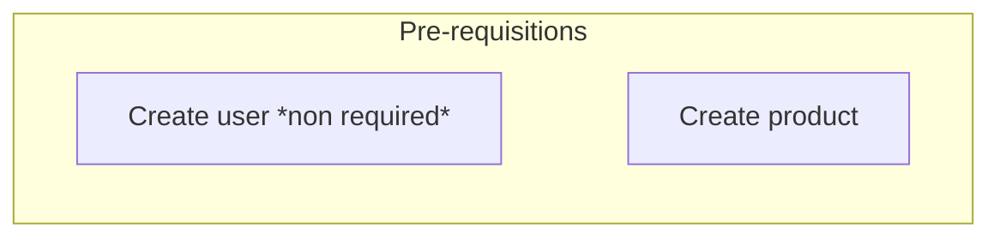
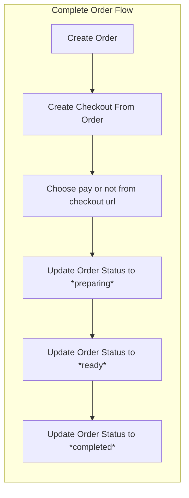

# Fiap Tech Fast Food

[](https://sonarcloud.io/summary/new_code?id=tech-challenge-fiap-5soat_tc-ff-order-api)
[](https://sonarcloud.io/summary/new_code?id=tech-challenge-fiap-5soat_tc-ff-order-api)
[](https://sonarcloud.io/summary/new_code?id=tech-challenge-fiap-5soat_tc-ff-order-api)
[](https://sonarcloud.io/summary/new_code?id=tech-challenge-fiap-5soat_tc-ff-order-api)
[](https://sonarcloud.io/summary/new_code?id=tech-challenge-fiap-5soat_tc-ff-order-api)

To solve a problem of a neighborhood fastfood, a system was created to manage the fastfood, where it is possible to register users, products, create orders and make payments, in addition to the system being resilient to failures and scalable.


### Tech

This api was built using [Golang](https://golang.org/) and some tools:
 * [gin](http://github.com/gin-gonic/gin) - Web framework 
 * [mongo-driver](http://go.mongodb.org/mongo-driver) - driver to deal with MongoDB
 * [viper](https://github.com/spf13/viper) - Config solution tool
 * [mockery](https://github.com/vektra/mockery) - Mock tool to use on unit tests
 * [swag](https://github.com/swaggo/swag) - Tool to generate swagger documentation
 * [docker](https://www.docker.com/) - Containerization tool
 * [docker-compose](https://docs.docker.com/compose/) - Tool to define and run multi-container Docker applications
 * [make](https://www.gnu.org/software/make/) - Tool to define and run tasks
 * [mermaid](https://mermaid-js.github.io/mermaid/#/) - Tool to create diagrams and flowcharts
 * [kubernetes](https://kubernetes.io/pt-br/) - Tool to automate deployment, scaling, and management of containerized applications


### Architecture
Demonstration: https://youtu.be/K7y3UWxIGY8


### Requests flow
Based on postman collection request names, the requests flow is:



## Run

The app can be started using docker and you can use the actions pre-defineds on Makefile

* ***Build image***

To build an image from project to push to a registry you can use the command below:

```sh
make build-image
```
this command will generate an image with this tag: *fiap-tech-fast-food*

If you want run this image locally you can use this command: 

```sh
docker run -e MONGODB_HOST=localhost -e MONGODB_PORT=27017 -e MONGODB_DATABASE=db -e API_PORT=8080 -p 8080:8080 -it fiap-tech-fast-food
```

* ***Generate docs***

To generate the documentation to publish on project like an openApi you can use the command below:

```sh
make serve-swagger
```
this command will generate a directory called `docs` 


### Development

To run in development for debug or improvement you can use another command:

```sh
make start-local-development
``` 

this command will start a container with hot-reload to any modification on the code. Including a container with an instance of MongoDB.

To stop the container execute:

```sh
make stop-local-development
```

### Test

Locally you can use the command below:

```sh
go test ./...  -v
```

or use a make action: 

```sh
make test   
```
